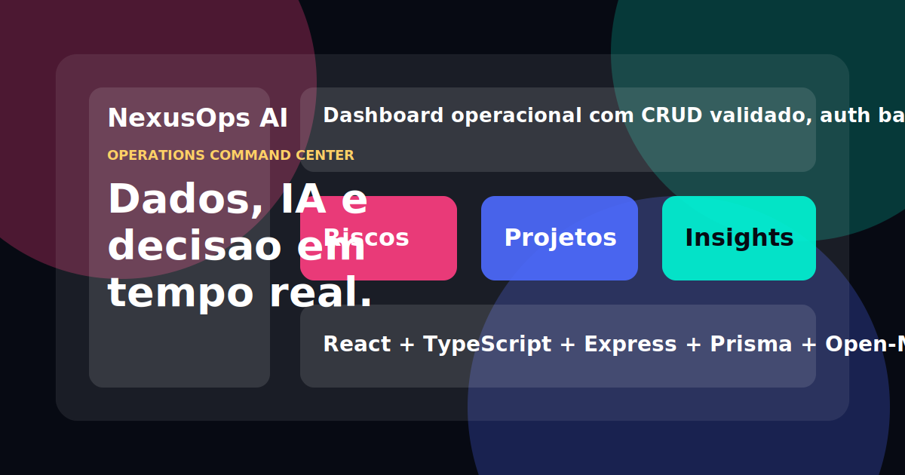

# NexusOps AI

Dashboard operacional para acompanhar projetos, receita, riscos externos e decisões em tempo real.

[](https://react.dev/)
[](https://www.typescriptlang.org/)
[](https://expressjs.com/)
[](https://www.prisma.io/)
[](https://nexusops-ai.onrender.com/)



## Acesso

Aplicação publicada: https://nexusops-ai.onrender.com/

```txt
E-mail: demo@nexusops.ai
Senha: NexusDemo@2026
```

## Sobre o Projeto

O NexusOps AI simula um painel de gestão para equipes que precisam decidir prioridades com base em carteira de projetos, prazos, receita, clima e histórico de atividade.

A proposta foi construir uma aplicação completa, com frontend, backend, autenticação, persistência, integração externa e uma camada de inteligência operacional. O sistema funciona mesmo sem chave de IA configurada, usando um fallback local que analisa os dados atuais do painel.

## Principais Funcionalidades

- Login com usuário demo e sessão via cookie HTTP-only.
- Dashboard dark com navegação lateral no estilo SaaS.
- CRUD completo de projetos.
- Validação de formulários com Zod.
- Perfis `Admin`, `Manager` e `Analyst`, com interface respeitando permissões.
- Indicadores de receita, progresso, prioridade e risco.
- Gráficos de pipeline e saúde dos projetos.
- Integração com a API pública Open-Meteo.
- Conversão de dados climáticos em recomendação operacional.
- Chat em tempo real entre abas usando `BroadcastChannel`.
- Endpoint de copiloto no backend, preparado para usar OpenAI API.
- Fallback inteligente quando não existe `OPENAI_API_KEY`.
- Timeline de auditoria para eventos importantes.
- Layout responsivo para desktop, tablet e mobile.

## Stack

| Camada | Tecnologias |
| --- | --- |
| Frontend | React 19, TypeScript, Vite |
| UI | CSS customizado, Lucide React |
| Backend | Node.js, Express |
| Banco/ORM | Prisma, SQLite |
| Validação | Zod |
| Testes | Vitest |
| Integrações | Open-Meteo, OpenAI-ready endpoint |
| Deploy | Render |

## Estrutura do Produto

O painel principal é dividido em módulos:

- **Dashboard**: visão geral de receita, riscos, alertas e copiloto.
- **Projetos**: criação, edição, filtros e exclusão de projetos.
- **Pipeline**: leitura comercial da carteira.
- **Atividades**: histórico de ações realizadas no sistema.
- **Clima & Risco**: sinais externos e análise de impacto.
- **Alertas**: prioridades calculadas a partir de prazo, progresso e clima.
- **Sala de Guerra**: chat em tempo real.
- **Copiloto**: recomendações baseadas no estado atual.
- **Usuários**: simulação de perfis e permissões.
- **Configurações**: visão das integrações e ambiente.

## Como Rodar Localmente

```bash
npm install
npm run db:push
npm run db:seed
npm run fullstack
```

Frontend:

```txt
http://localhost:5173
```

Backend:

```txt
http://localhost:3333
```

## Scripts

```bash
npm run dev          # Vite em modo desenvolvimento
npm run server       # API Express
npm run fullstack    # Frontend e backend juntos
npm run db:push      # Inicializa SQLite e Prisma
npm run db:seed      # Popula usuário demo e dados iniciais
npm run lint         # ESLint
npm test             # Testes com Vitest
npm run build        # Build de produção
```

## Rotas da API

```txt
POST   /api/auth/login
GET    /api/auth/me
POST   /api/auth/logout

GET    /api/projects
POST   /api/projects
PUT    /api/projects/:id
DELETE /api/projects/:id

GET    /api/activity
POST   /api/ai-chat
GET    /api/health
```

## Integração com IA

O projeto pode rodar de duas formas:

1. **Modo demonstrativo**
   - Não exige chave de API.
   - O backend retorna uma recomendação baseada nos projetos, prazos, progresso e clima.
   - Ideal para demo pública.

2. **Modo com provedor**
   - Usa `OPENAI_API_KEY` no backend.
   - A chave nunca é exposta no navegador.
   - Se o provedor falhar, o sistema volta para o fallback local sem quebrar a experiência.

Variáveis opcionais:

```env
OPENAI_API_KEY=sua_chave
OPENAI_MODEL=gpt-4.1-mini
```

## Banco de Dados

O projeto usa Prisma com SQLite para facilitar a execução local e o deploy de demonstração.

```env
DATABASE_URL=file:./dev.db
```

Para um ambiente de produção com dados duráveis, o caminho recomendado é trocar o datasource do Prisma para PostgreSQL e usar uma instância gerenciada, como Render PostgreSQL, Supabase, Railway ou Neon.

Exemplo:

```prisma
datasource db {
  provider = "postgresql"
  url      = env("DATABASE_URL")
}
```

## Deploy

O deploy atual roda no Render como um serviço Node.

Configuração usada:

```txt
Build command: npm ci && npm run build
Start command: npm start
Health check: /api/health
```

Variável necessária no modo demo:

```env
DATABASE_URL=file:./dev.db
```

Observação: para este projeto, não é necessário definir `NODE_ENV=production` manualmente no painel do Render. Isso pode impedir a instalação de dependências usadas no build.

## Qualidade

Estado atual das verificações:

```txt
Lint: OK
Testes: OK
Build: OK
```

Cobertura principal:

- Validação de dados de projeto.
- Cálculo de risco operacional.
- Agrupamento de projetos por status.
- Receita por status.

## Decisões Técnicas

- O frontend possui fallback local para manter a demo utilizável mesmo se a API estiver indisponível.
- A autenticação real acontece no backend, com cookie HTTP-only.
- O endpoint de IA fica no servidor para proteger credenciais.
- A integração climática usa Open-Meteo por ser pública e sem chave.
- O chat usa `BroadcastChannel` para demonstrar sincronização de estado entre abas.
- O layout foi construído com CSS próprio para evitar dependência pesada de UI kit.

## Melhorias Futuras

- Migrar SQLite para PostgreSQL em produção.
- Adicionar testes de componentes para fluxos principais.
- Criar pipeline de CI com lint, testes e build.
- Adicionar persistência dedicada para mensagens do chat.
- Incluir capturas reais da interface no README.
